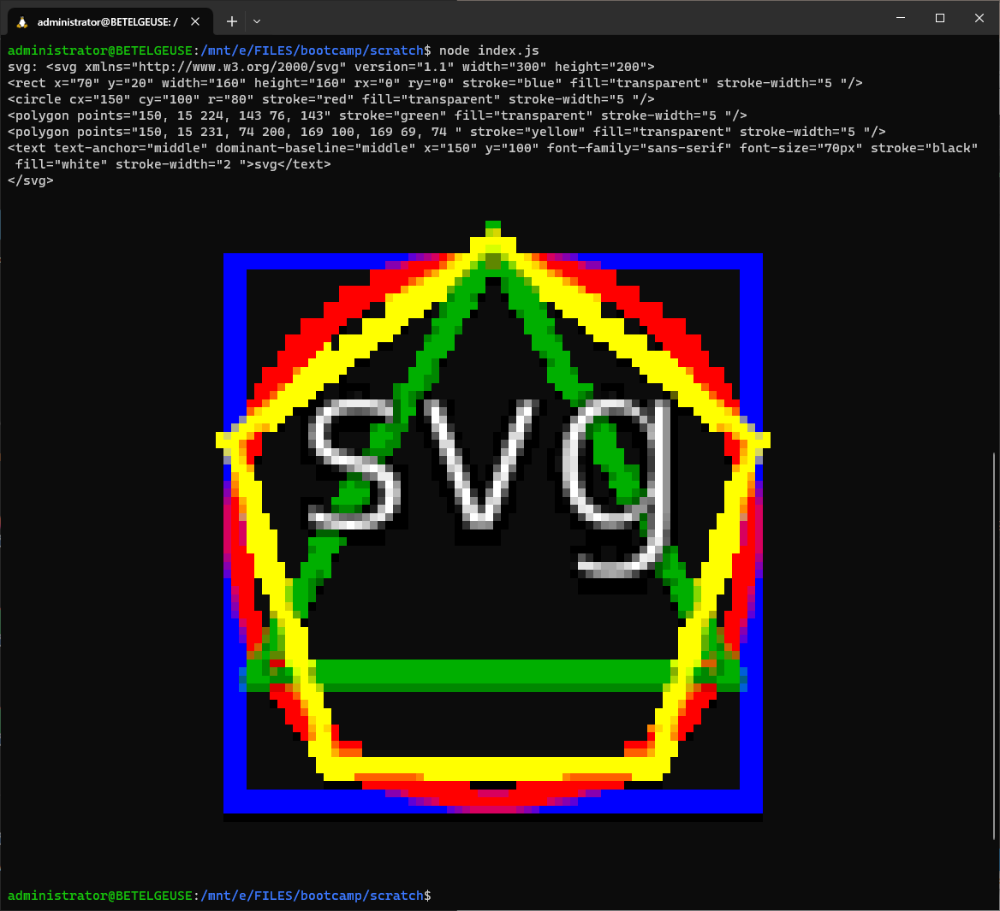
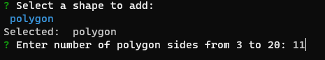
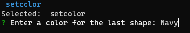
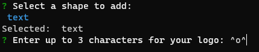
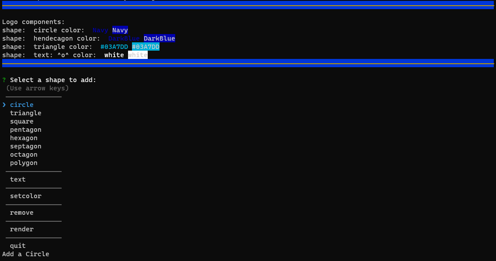
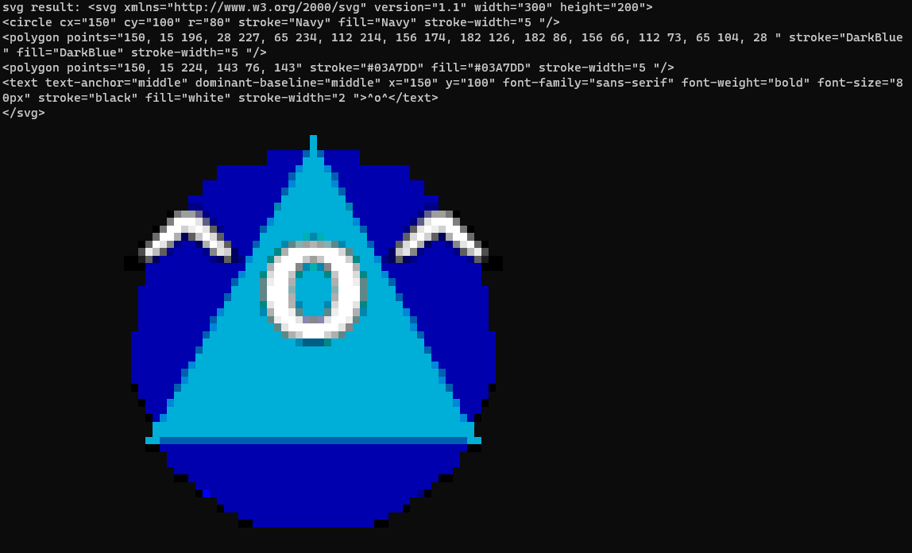
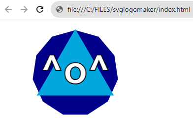

# SVG Logo Maker

## Description

This nodejs command line utility lets users create an SVG logo by layering simple shapes and text.

## Repository

[https://github.com/andrenrwn/svglogomaker](https://github.com/andrenrwn/svglogomaker)

## Installation

- nodeJS (if not yet installed)
- clone this repository
  $ git clone https://github.com/andrenrwn/svglogomaker.git
- npm install

## Usage

Run the utility by executing the bash script:
$ ./start_svglogomaker.sh

(The bash script adds the NODE options required to run jest tests with import, see: Testing)

You will be presented with the following selection menu:

    ────────────────
    Logo components:
    <empty>
    ────────────────

    ? Select a shape to add:
     (Use arrow keys)
     ──────────────
    ❯ circle
      triangle
      square
      pentagon
      hexagon
      septagon
      octagon
      polygon
     ──────────────
      text
     ──────────────
      setcolor
     ──────────────
      remove
     ──────────────
      render
     ──────────────
      quit

A logo is based on layers of shapes and text.
To create a logo:

1. Add a shape.
   Select circle, triangle, polygon, etc to add a shape layer.
   The shape is added with a default transparent color and black border.
   Selecting polygon will ask you the number of sides (up to 20 sides).

   

2. Set a color to the last added shape.
   Select "setcolor" to type in a color.
   Only the following color formats are recognized:

   - extended HTML color keywords as defined in [W3C CSS standards ](https://www.w3.org/TR/css-color-3/ "W3C CSS Colors Specification")
   - RGB color values in hexadecimal format, ie. #12ABEF ( #rrggbb )

   

3. Add text.
   Select "text" and type in up to three characters for the logo.
   Text by default is colored white.
   Select "setcolor" to specify the color.

   

4. Select "remove" to undo the last added shape.
   Your shape layers will be displayed as they are added.

   

5. Select "render" to create the SVG logo.
   The logo is saved in the file "logo.svg".
   The logo is also rendered to "logo.png" and will display it on terminals that support it.

   

6. Open index.html with your browser to see the end result.

   

## License

MIT

## Components

lib/shapes.mjs - Module with Logo and Shape objects. Each Logo consists of multiple shapes. Basic shapes (Triangle, Circle, Square, Polygon, etc) inherit properties of Shape.
lib/validatecolor.mjs - Module to validate HTML colors typed in by the user.

This utility depends on the following npm packages:

@inquirer/prompts - provides an interactive terminal interface, menu selection, and user input
chalk - text colors
sharp - image utility to render an .SVG markup into a .png image
terminal-image - shows a .png image on supported terminals

## Testing

Run the following bash script to start unit testing with jest:
./start_test.sh

SVG Logo Maker uses jest for testing components of the shapes.mjs module.
Jest may not be supported natively and you may get errors like this:

`SyntaxError: Cannot use import statement outside a module`

`      at Runtime.createScriptFromCode (node_modules/jest-runtime/build/index.js:1505:14)``

In order to let jest use imports, allow node to run in experimental mode by setting these environment variables in your terminal:

`$ NODE_OPTIONS="--experimental-vm-modules npx jest"`

`$ export NODE_OPTIONS`

See: [https://stackoverflow.com/questions/74289336/jest-node-js-syntaxerror-cannot-use-import-statement-outside-a-module](https://stackoverflow.com/questions/74289336/jest-node-js-syntaxerror-cannot-use-import-statement-outside-a-module)

## Questions

Feel free to post any questions in this repository's issues tab.
